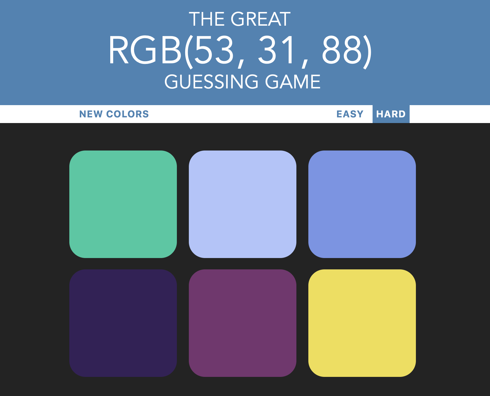

# webSimple
A repository with some simple and easy web apps and games.

## RGB Color Guessing Game

A simple "game" that consists in guess a color shown as RGB mode.

Click here to [play](https://htmlpreview.github.io/?https://github.com/aaroni34/webSimple/blob/master/colorGame/colorGame.html) the game.

## To Do List

A simple To Do List to add your current tasks, mark them as done and even delete them. For now, it isn't responsive.

Click here to [preview](https://htmlpreview.github.io/?https://github.com/aaroni34/webSimple/blob/master/toDoList/todos.html).

## Patatap Clone

Simple web app that shows animated circles that scale down until dissapear and plays different sounds depending in which key you press. It's a simpler version of the web [patatap](https://patatap.com).

> Can't not preview due to Access-Control-Allow-Origin.

## Calculator

Simple web calculator. It can multiply, add, subtract and divide.For now, it isn't responsive and percentage function is not available.

Click here to [preview](https://htmlpreview.github.io/?https://github.com/aaroni34/webSimple/blob/master/calculator/calculator.html).
